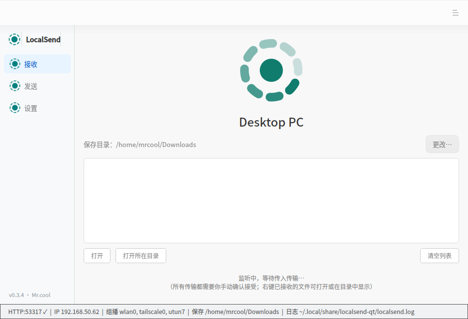
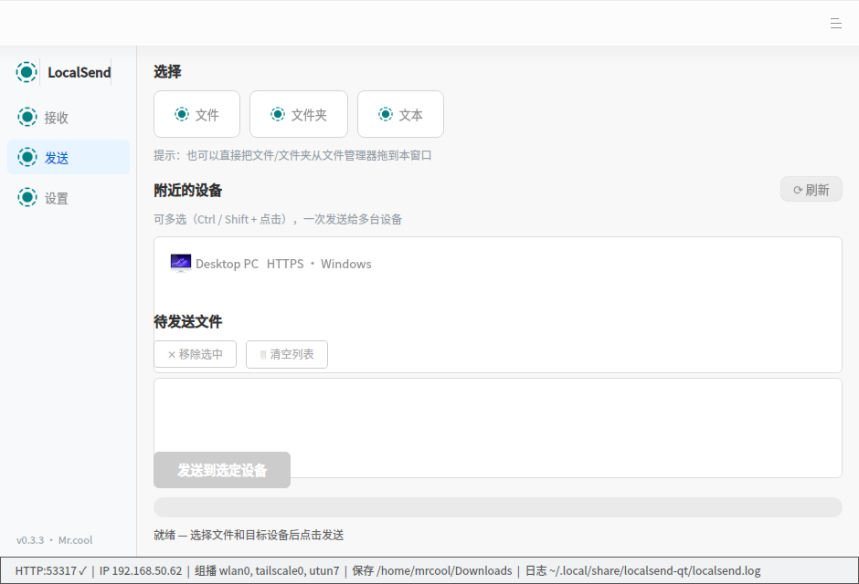

# LocalSend（Qt / DTK 原生版）

基于 [LocalSend 协议 v2.2](https://github.com/localsend/protocol) 用 **C++ / Qt5 Widgets / 统信 DTK** 全新实现的局域网互传客户端，与官方 LocalSend（Flutter）**协议 100% 兼容**——手机、Windows、macOS、Linux 上的官方客户端可直接与本程序互相发现、互发文件与文本消息。

> 适用场景：统信 UOS 20、华为 L420x / 麒麟 9000C（aarch64）等无 OpenGL 硬件加速的国产化环境。原版 Flutter 桌面版依赖 OpenGL 上下文，在这类设备上窗口全黑无法使用；本程序基于 Qt Widgets 软件光栅渲染，**无需 GPU / Mesa DRI 驱动**即可流畅运行。

## 界面预览

| 接收页 | 发送页 |
|:---:|:---:|
|  |  |

## 功能特性

- **设备发现**：组播 UDP `224.0.0.167:53317` 广播 + `/api/localsend/v2/register` 双向注册，自动刷新；多网卡环境自动加入所有 UP 网卡的组播组，并优先选择局域网（私网）接口发送，避免 VPN / 虚拟网卡劫持
- **文件传输**：向局域网内设备发送文件 / 整个文件夹，支持**多选设备一次发送**，逐文件进度显示
- **文本消息**：与官方一致的消息格式（`preview` 字段携带全文），对端直接显示为消息而非文件
- **接收确认**：所有传入传输先弹出确认对话框（发送方别名、TLS 指纹、文件列表与大小、消息内容摘要），确认后才接收，拒绝即回 403
- **接收页**：旋转动态 Logo + 大字显示附近设备名（多台轮播）；接收完成的文件支持「打开文件」「打开所在目录」「复制路径」右键操作
- **HTTPS 兼容**：对官方客户端的 HTTPS（自签名证书 + 要求 TLS 客户端证书）完整支持，程序内置客户端证书；协议失败自动回退 http
- **发送容错**：`prepare-upload` 等待接收方决策最长 30 秒（官方客户端会挂起响应等待用户选择）；HTTP 204 正确识别为「消息已读取并关闭」（官方消息传输的成功语义）；403 / 429 给出明确的「对方拒绝 / 对方正忙」提示
- **DTK 原生 UI**：DApplication / DMainWindow，左侧导航 + 分页布局，窗口底部状态栏实时自检（HTTP 监听 ✓✗、本机 IP、组播接口、保存目录、日志路径）
- **运行日志**：全量落盘 `~/.local/share/localsend-qt/localsend.log`，含启动横幅、传输明细、TLS 状态，便于事后排查

## 下载安装（aarch64 / UOS 20）

从 [Releases](https://github.com/Mrcoolfuyu/localsend/releases) 下载 `localsend-qt-vX.Y.Z-aarch64-UOS.tar.gz`：

```sh
tar xzf localsend-qt-v*-aarch64-UOS.tar.gz
sudo install -Dm755 localsend-qt /opt/localsend-qt/localsend-qt
sudo install -Dm644 localsend-qt.desktop /usr/share/applications/localsend-qt.desktop
sudo install -Dm644 logo-512.png /usr/share/pixmaps/localsend-qt.png
sudo update-desktop-database /usr/share/applications
```

之后在启动器或桌面即可找到 LocalSend。

## 从源码构建

依赖（UOS 20 / Debian 系）：

```sh
sudo apt-get install -y qtbase5-dev qt5-qmake qttools5-dev-tools \
     libdtkcore-dev libdtkgui-dev libdtkwidget-dev cmake g++ make
```

构建：

```sh
mkdir build && cd build
cmake .. -DCMAKE_BUILD_TYPE=Release
make -j$(nproc)
```

产物：`build/localsend-qt`（GUI 主程序）、`localsend-selftest`（协议自测）、`localsend-itest`（真实组播集成测试）、`localsend-ssltest`（HTTPS/mTLS 专项测试）。

无 DTK 的环境（普通 Ubuntu / WSL）可只构建协议层验证互通性：

```sh
cmake .. -DBUILD_GUI=OFF && make -j$(nproc) && ./localsend-selftest
```

## 测试

```sh
./localsend-selftest   # 回环自测：普通传输 / 协议回退 / 文本消息 三阶段
./localsend-itest      # 真实 UDP 组播发现 + 双实例互传
./localsend-ssltest <端口>   # 配合 tools/fake_https_mtls.py 验证 TLS 客户端证书
```

## 目录结构

```
localsend-qt/
├── CMakeLists.txt          构建配置（BUILD_GUI 开关控制 GUI/纯协议层）
├── build.sh                UOS 一键构建脚本
├── localsend-qt.desktop    桌面入口
├── resources/
│   ├── localsend.qrc       Qt 资源表（图标 + 内置 TLS 客户端证书）
│   ├── icons/              LocalSend 官方 LOGO 系列
│   └── certs/              内置自签客户端证书（mTLS）
├── src/
│   ├── main.cpp            程序入口（强制 NoProxy、DTK 初始化、--screenshot 调试）
│   ├── localsend.h/.cpp    协议核心：组播发现、register/prepare-upload/upload、消息投递
│   ├── httpserver.h/.cpp   极简 HTTP 服务端：流式接收（Content-Length + chunked）、确认挂起、204 消息
│   ├── mainwindow.h/.cpp   DTK 原生 UI：接收/发送/设置三页
│   ├── spinlogo.h/.cpp     接收页旋转动态 Logo（自绘 QTimer 动画）
│   ├── logger.h/.cpp       运行日志落盘
│   ├── selftest.cpp        无界面协议自测
│   ├── itest.cpp           真实组播集成测试
│   └── ssltest.cpp         HTTPS / mTLS 专项测试
└── tools/                  测试辅助（模拟官方 HTTPS 对端、mTLS 对端、GUI 截图脚本）
```

## 已知限制

- 暂未实现：历史记录、收藏设备、PIN 加密连接、多语言切换、自动更新
- 设备发现依赖局域网组播可达（部分 AP / VLAN 会隔离组播）
- 程序启动即强制 `QNetworkProxy::NoProxy`：LocalSend 仅走局域网直连，若被系统 SOCKS 代理接管，`QTcpServer::listen()` 会报 `socksv5 command not supported` 导致所有端口无法监听——这是有意为之的防护

## 排障

运行日志位于 `~/.local/share/localsend-qt/localsend.log`，包含每次启动的版本、监听与组播状态、全部收发明细。窗口底部状态栏的 `HTTP:53317 ✓✗` 可直接判断端口监听是否正常（✗ 多为端口被旧实例占用，`pkill -x localsend-qt` 后重试）。

## 致谢

- 协议与交互设计基于 [localsend/localsend](https://github.com/localsend/localsend)（Apache-2.0），LOGO 资源取自官方仓库
- 统信 [DTK](https://github.com/linuxdeepin/dtkwidget) 提供国产化桌面原生体验

## 作者

**Mr.cool** — https://github.com/Mrcoolfuyu/
